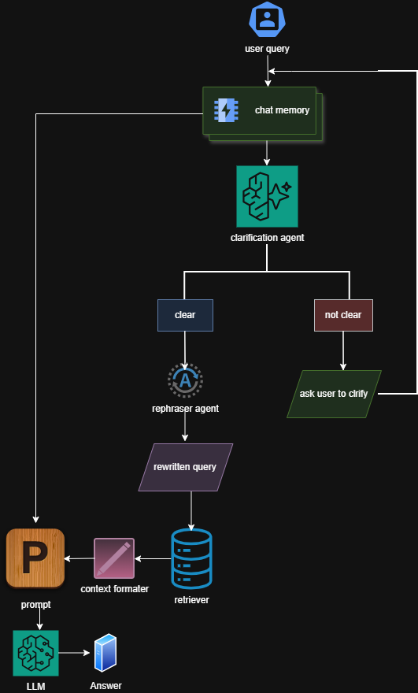
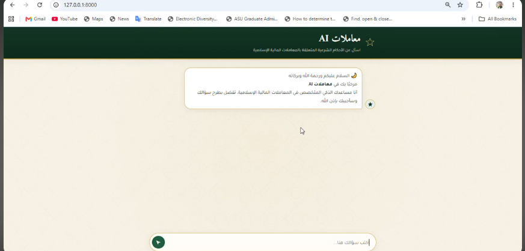

# Muamalat AI | معاملات AI

> **An AI-powered assistant for Islamic Financial Jurisprudence (Fiqh al-Muamalat).**

Muamalat AI is an end-to-end **Retrieval-Augmented Generation (RAG)** system that answers questions related to **Islamic financial transactions** using verified fatwas. The system combines semantic search, vector embeddings, and Large Language Models (LLMs) to generate accurate, context-grounded responses through a FastAPI backend.

---

# System Architecture

<p align="center">
  
</p>

---

# 🎥 Project Demo

<p align="center">
  <a href="https://youtu.be/eDT6bg_Um9c?si=eTSATjzD5W6vsk4q">
    
  </a>
</p>

<p align="center">
Click the image above to watch the project demonstration.
</p>

---

# Features

- End-to-End Retrieval-Augmented Generation (RAG)
- Multi-Agent Architecture
- Semantic Search using ChromaDB
- HuggingFace Embeddings (BAAI/bge-m3)
- Groq LLM Integration
- FastAPI REST API
- Conversation Memory
- Prompt Engineering
- Source-Grounded Responses
- Automated Evaluation Pipeline

---

# Multi-Agent Workflow

The system consists of several specialized AI agents working together:

| Agent                   | Responsibility                                                        |
| ----------------------- | --------------------------------------------------------------------- |
| **Clarification Agent** | Detects ambiguous questions and asks follow-up questions when needed. |
| **Rephraser Agent**     | Reformulates user questions into retrieval-friendly queries.          |
| **Memory Manager**      | Maintains conversation history and pending clarification state.       |
| **RAG Pipeline**        | Retrieves relevant fatwas and generates grounded responses.           |

---

# Retrieval Pipeline

1. User submits a question.
2. Clarification Agent checks whether the question is sufficiently clear.
3. Rephraser Agent rewrites the query for better retrieval.
4. ChromaDB retrieves the most relevant fatwas.
5. Retrieved documents are formatted into the prompt.
6. Groq LLM generates a grounded response.
7. Conversation memory is updated.

---

# Project Structure

```text
app/
│
├── Agents/          # AI agents
├── api/             # FastAPI routes & schemas
├── evaluation/      # Evaluation pipeline
├── prompts/         # Prompt templates
├── rag/             # Retrieval pipeline
├── static/          # CSS, JavaScript, images
├── templates/       # HTML templates
└── main.py          # FastAPI application
```

---

# Tech Stack

- Python
- FastAPI
- LangChain
- ChromaDB
- HuggingFace Transformers
- BAAI/bge-m3 Embeddings
- Groq API

---

# Installation

Clone the repository:

```bash
git clone https://github.com/YOUR_USERNAME/muamalat-ai.git
cd muamalat-ai
```

Install the required packages:

```bash
pip install -r requirements.txt
```

---

# Environment Variables

Create a `.env` file in the project root:

```env
GROQ_API_KEY=your_groq_api_key
```

---

# Dataset

The knowledge base consists of **verified Islamic finance fatwas** stored in JSON format and indexed into **ChromaDB** for semantic retrieval.

---

# Running the Application

Start the FastAPI server:

```bash
uvicorn app.main:app --reload
```

Open your browser:

- **Application:** http://127.0.0.1:8000
- **Swagger UI:** http://127.0.0.1:8000/docs

---

# Evaluation

The project includes an automated evaluation pipeline that measures the quality of generated answers against the retrieved context.

---

# 👤 Author

**Ahmed Fouad**

AI Engineer | LLM Engineer | Machine Learning Engineer

- LinkedIn: https://www.linkedin.com/in/ahmed-fouad-182186376

---

# Support

If you found this project useful, consider giving it a **Star ⭐** on GitHub.
